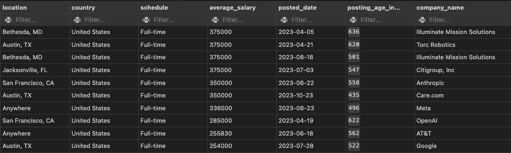

# 🛠️ **SQL Queries for Data Analytics Job Insights**

---

## 🚀 **Background**

What follows are 5 key SQL queries, each designed to uncover valuable insights into the Data Analytics job market.  

Below, you'll find the methodology, results, and actionable insights for each query, complete with visual placeholders to enhance readability and comprehension.

Click on each header to explore each SQL code further!

---

## 1️⃣ **[Query: What are the top PAYING Data Analyst jobs?](./1_top_paying_jobs.sql)**


### 📊 **Analysis:**
This query focuses on identifying the highest-paying Data Analyst roles across Canada and the United States, providing an overview of the top employers and job locations.

### ⚙️ **Methodology:**
- **Data Sources**: Job postings and salary data from the database.
- **Filters**: Limited to "Data Analyst" roles in Canada and the United States with verified salary information.
- **Calculations**:
  - `ROUND()` to simplify salary averages.
  - Calculated posting age in days for job relevancy.

### 📈 **Visual Insights:**

> *(Output Chart: Top 10 Paying Data Analyst Roles by Salary)*




### 🔑 **Key Findings:**
- Titles with terms like "Director" and "Senior" dominate high-paying roles.
- Employers are primarily tech-oriented companies.
- Posting ages indicate a mix of recent and older listings.

---

## 2️⃣ **[Query: What SKILLS are required for the top-paying Data Analyst jobs?](./2_top_paying_job_skills.sql)**

### 📊 **Analysis:**
This query identifies the most common skills among the top 10 highest-paying Data Analyst positions, providing insights into the technical proficiencies valued by high-paying employers.

### ⚙️ **Methodology:**
- **Data Sources**: Job postings and skills databases.
- **Joins**: Combined top-paying jobs with corresponding skill data.
- **Aggregation**: Counted occurrences of each skill in the top-paying job listings.

### 📈 **Visual Insights:**
> *Example CTE code (PostgreSQL)*
```sql
WITH top_paying_jobs AS (
    SELECT
        job_id,
        job_title,
        salary_year_avg,
        name AS company_name
    FROM
        job_postings_fact

    LEFT JOIN company_dim ON job_postings_fact.company_id = company_dim.company_id

    WHERE
        job_title_short = 'Data Analyst' AND
        job_country IN ('Canada', 'United States') AND
        salary_year_avg IS NOT NULL
    ORDER BY
        salary_year_avg DESC
    LIMIT 10
)
```

### 🔑 **Key Findings:**
1. **Top Skills by Frequency**:
   - SQL (8 mentions)
   - Python (7 mentions)
   - Tableau (6 mentions)
2. SQL and Python show the highest correlation with high salaries, emphasizing their value in this field.

---

## 3️⃣ **[Query: What are the most in-demand SKILLS for Data Analysts?](./3_top_demanded_skills.sql)**

### 📊 **Analysis:**
This query highlights the skills most frequently requested in job postings, offering a view of demand trends within the Data Analytics field.

### ⚙️ **Methodology:**
- **Data Sources**: Job postings with associated skill requirements.
- **Joins**: Linked job postings to skill data.
- **Calculations**:
  - `COUNT()` to tally occurrences of skills.
  - `GROUP BY` and `ORDER BY` to rank skills by demand.

### 📈 **Visual Insights:**
> *(Table 1: Demand of Each Skill)*

| **Skill**   | **Demand Count** |
|-------------|------------------|
| SQL         | 35,752           |
| Excel       | 28,343           |
| Tableau     | 19,942           |
| Python      | 19,172           |
| SAS         | 13,532           |

### 🔑 **Key Findings:**
- **Most Demanded Skills**:
  1. SQL
  2. Excel
  3. Tableau
- SQL leads demand by a large margin, underscoring its importance in the field.

---

## 4️⃣ **[Query: What are the top SKILLS based on salary?](./4_top_paying_skills.sql)**

### 📊 **Analysis:**
This query identifies the skills associated with the highest average salaries, highlighting niche competencies that could lead to higher earning potential.

### ⚙️ **Methodology:**
- **Data Sources**: Salary data and skill mentions in job postings.
- **Joins**: Connected job postings with their required skills.
- **Calculations**: Used `AVG()` to compute the average salary for each skill and sorted them to rank the highest-paying ones.

### 📈 **Visual Insights:**
> *Example of Join code (PostgreSQL)*
```sql
SELECT
    skills,
    ROUND(AVG(salary_year_avg), 0) AS avg_salary
FROM job_postings_fact
INNER JOIN skills_job_dim ON job_postings_fact.job_id = skills_job_dim.job_id
INNER JOIN skills_dim ON skills_job_dim.skill_id = skills_dim.skill_id
WHERE
    job_title_short = 'Data Analyst' AND
    job_country IN ('Canada', 'United States') AND
    salary_year_avg IS NOT NULL
GROUP BY
    skills
ORDER BY
    avg_salary DESC
LIMIT 25;
```


### 🔑 **Key Findings:**
- Skills linked to high salaries are often niche, suggesting potential outliers in the dataset.
- Niche technical proficiencies can sometimes lead to lucrative roles but may also represent specialized positions.

---

## 5️⃣ **[Query: What are the most in-demand AND highest paying SKILLS (optimal) for Data Analysts?](./5_optimal_skills.sql)**

### 📊 **Analysis:**
This query combines both demand and salary data to uncover the skills that offer the best combination of high pay and high demand. It serves as a roadmap for prioritizing skill development.

### ⚙️ **Methodology:**
- **Data Sources**: Skills, demand frequency, and salary data from job postings.
- **Joins**: Merged skill mentions with corresponding demand and salary data.
- **Calculations**: Used `COUNT()` for demand and `AVG()` for salary, sorted by both to identify the optimal skills.

### 📈 **Visual Insights:**
> *(Table 2: Demand and Related Salary of Each Skill)*

| Skill      | Demand Count | Average Salary |
|------------|--------------|----------------|
| SQL        | 2531         | 97,395         |
| Excel      | 1821         | 87,015         |
| Python     | 1441         | 103,284        |
| Tableau    | 1376         | 99,465         |
| R          | 894          | 100,290        |
| Power BI   | 848          | 92,976         |
| PowerPoint | 467          | 89,050         |
| Word       | 464          | 83,811         |
| SAS        | 463          | 94,193         |


### 🔑 **Key Findings:**
1. Among these top skills, **Python** commands the highest average salary.
2. Skills like SQL and Excel remain highly in demand, offering consistent opportunities.

---

### 📝 **Next Steps**
To improve this repository:
- Replace placeholders with visualizations generated from query outputs.
- Incorporate interactive charts or dashboards if feasible.
- Expand analysis to include trends over time or geographical patterns.

By combining data-driven insights with clear visualization, this project demonstrates a strong understanding of SQL querying and its application in the Data Analytics domain.

---

### 🔗 **Explore the Queries**
For full SQL code, detailed comments, and execution steps, click the header links or check the respective query files in this directory!

Yours in Solutions,  
Julian
